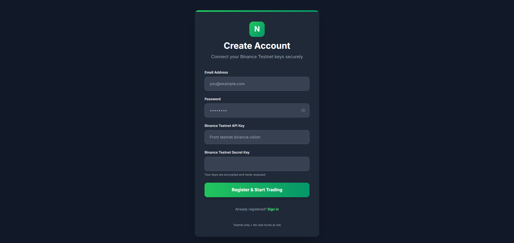
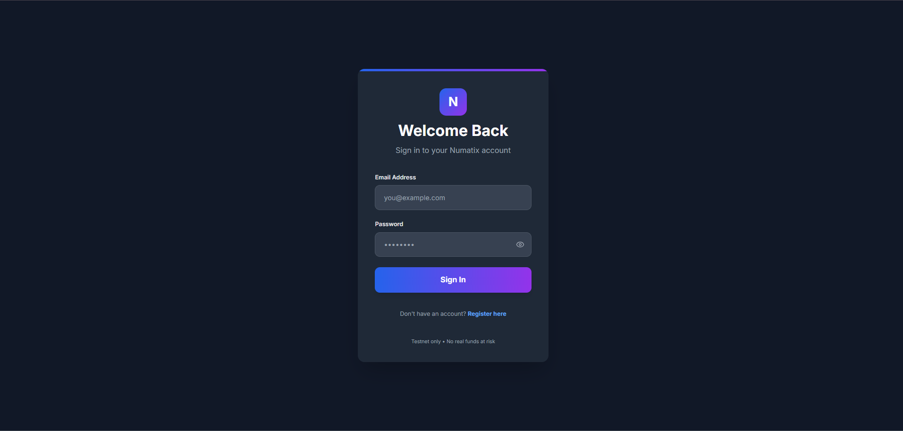
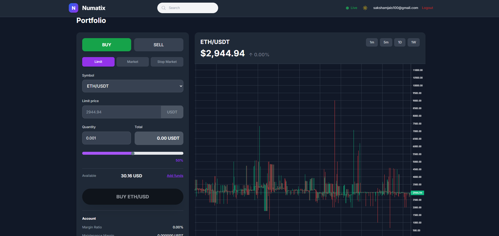
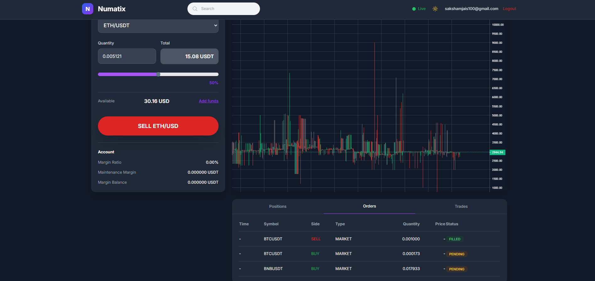

# Real-Time Trading Platform (Numantix Assignment)

This repository contains my submission for the **Numantix Fullstack Developer Hiring Challenge**.  
It is a distributed, real-time crypto trading platform built using modern web and backend technologies, following an event-driven microservices architecture.

---

## 🧠 Overview

The system allows users to:
- Register & authenticate securely
- Connect Binance Testnet API keys
- View real-time price charts
- Place market orders
- Receive live order status updates

All trading logic is handled through Redis-based message queues and WebSocket event broadcasting, just like real trading systems.

---

## 🛠 Tech Stack

**Frontend**
- Next.js
- TypeScript
- Tailwind CSS
- lightweight-charts
- WebSocket client

**Backend**
- Node.js + Express
- Redis (Pub/Sub)
- PostgreSQL / SQLite (Prisma)
- JWT Authentication
- Binance Testnet API

---

## 🏗 System Architecture

```
Frontend → API Gateway → Redis (Command Bus) → Order Execution Service
     ↑                                         ↓
 WebSocket ← Event Service ← Redis (Events) ← Order Events
```

---

## 📦 Monorepo Structure

```
apps/
 ├── backend/          # Express API Gateway
 ├── execution-service/ # Binance order executor
 ├── event-service/    # WebSocket broadcaster
 └── frontend/         # Next.js trading UI
packages/
 └── shared/           # Shared types
```

---

## 🚀 Features

- JWT based authentication
- Encrypted Binance API key storage
- Redis based command & event bus
- WebSocket live updates
- TradingView style charts
- Real-time positions & orders table
- Symbol & timeframe switching

---

## 📸 Screenshots

| Feature | Preview |
|--------|---------|
| SignUp Page |  |
| Login Page |  |
| Trade Panel |  |
| Order Updates |  |

_(Replace these image paths with your actual screenshot files)_

---

## 🎥 Demo Video

#### ▶ Watch full Video Demo: [2-minute walkthrough](https://res.cloudinary.com/djtn57e6e/video/upload/v1766599370/1224_vjaoch.mp4)


---

## 🧪 Local Setup

1. Clone the repo
```
git clone https://github.com/saksham-jais/fullstack-assignment-numatix-saksham-jais
cd fullstack-assignment-numatix-saksham-jais
```

2. Install dependencies
```
npm install
```

3. Setup environment variables  
Create `.env` files for each service based on `.env.example`

4. Run all services
```
npm run dev:all
```

---

## 🧠 Key Design Decisions

- Redis is used to decouple API from order execution  
- WebSockets are used to stream order updates  
- One WebSocket connection per user  
- Prisma ensures database consistency  
- Binance Testnet avoids real money risk  

---

## 🎯 What I Would Improve

- Order cancellation
- Advanced chart indicators
- Unit testing
- Load balancing & Redis clustering
- Alert system

---

## ⚠ LLM Usage

Some parts of this project were assisted using LLMs (within 20%).  
All code was reviewed, understood, and implemented manually.

---

## 📌 Author

**Saksham Jaiswal**  
CSE (AI & ML), VIT Bhopal  
GitHub: https://github.com/saksham-jais
